# 知卡卡账单 (ZhiKaKa-Bills)

一个轻量级的本地信用卡账单管理工具，可从邮箱抓取信用卡账单，提醒每笔账单的还款日，帮你推算当日刷哪张信用卡免息期最长最划算。

> 🔒 **纯本地运行**：所有数据保存在你自己的电脑上，仅监听 `127.0.0.1`，不对外暴露，不上传任何云端服务。

***

## ✨ 功能特性

| **功能**      | **说明**                                  |
| ----------- | --------------------------------------- |
| 📧 自动抓账单    | 一键连接 QQ 邮箱 IMAP，自动识别 11 家银行的信用卡账单邮件     |
| 🏦 11 家银行支持 | 招商、工商、建设、交通、平安、浦发、中信、光大、民生、广发、农业        |
| 📅 免息期计算    | 根据每张卡的账单日和还款规则，自动计算今日免息期榜单，指导你今天刷哪张卡最划算 |
| ⏰ 还款日提醒     | 自动计算每张卡的还款日，到期前在首页高亮提醒                  |
| 💳 卡包管理     | 管理多张信用卡，记录账单日、还款规则、信用额度、年费信息            |
| 📝 自定义账单    | 支持录入非信用卡账单（如保险、贷款、房租等），统一管理还款           |
| 🎫 年费管理     | 记录每张卡的年费规则和消费达标进度，避免被扣年费                |
| 🔔 消息中心     | 新账单提醒、还款提醒等消息统一管理                       |
| 🖥️ Web 界面  | 浏览器访问，响应式设计，手机也能用                       |
| 💾 本地存储     | 数据保存在本地 JSON 文件，支持手动备份                  |

***

## 🏦 支持的银行

| **银行** | **发件人关键词**                     | **解析状态** |
| ------ | ------------------------------ | -------- |
| 招商银行   | cmbchina.com / 95555           | ✅        |
| 工商银行   | icbc.com.cn                    | ✅        |
| 建设银行   | ccb.com                        | ✅        |
| 交通银行   | bankcomm.com / bocom.com.cn    | ✅        |
| 平安银行   | pingan.com                     | ✅        |
| 浦发银行   | spdb.com.cn                    | ✅        |
| 中信银行   | citiccard.com / citic.com      | ✅        |
| 光大银行   | cebbank.com                    | ✅        |
| 民生银行   | cmbc.com.cn / minshengbank.com | ✅        |
| 广发银行   | cgbchina.com.cn                | ✅        |
| 农业银行   | abchina.com / 95599            | ✅        |

> 账单解析采用三层容错设计：HTML 去标签 → 模糊关键词匹配 → 智能金额提取，兼容各银行不同的邮件格式。

***

## 🚀 快速开始

### 环境要求

* Python 3.8 或更高版本（[下载 Python](https://www.python.org/downloads/)）
* Windows / macOS / Linux（已在 Windows 10/11 测试通过，macOS/Linux 理论兼容）
* 一个 QQ 邮箱（用于接收信用卡账单邮件）

### 1. 下载代码

```bash
git clone https://github.com/ai-yukin/ZhiKaKa-Bills.git
cd ZhiKaKa-Bills
```

或者直接下载 ZIP 包解压。

### 2. 安装 Python 和依赖

**方式一：标准方式（推荐新手）**

1. 从 [https://www.python.org/downloads/](https://www.python.org/downloads/) 下载 Python 3.8+
2. 安装时**务必勾选 "Add Python to PATH"**
3. 安装依赖：

```bash
pip install -r requirements.txt
```

**方式二：使用 uv（更快，推荐开发者）**

如果你安装了 [uv](https://github.com/astral-sh/uv) Python 包管理器：

```bash
uv venv .venv --python 3.12
uv pip install -r requirements.txt
```

> `启动知卡卡.bat` 会自动检测并优先使用项目内的 `.venv` 虚拟环境。

### 3. 启动程序

**Windows：** 双击 `启动知卡卡.bat`

**macOS / Linux：**

```bash
chmod +x start.sh
./start.sh
```

或者直接运行：

```bash
python server.py
```

### 4. 访问界面

程序启动后会**自动打开浏览器**，访问：[**http://localhost:5000**](http://localhost:5000)

如果浏览器没有自动弹出，请手动打开浏览器输入上述地址。

> ⚠️ 启动后会出现一个黑色命令行窗口，**不要关闭它**，关闭就等于停止程序。使用完后在命令行窗口按 `Ctrl+C` 或直接关闭窗口即可停止。

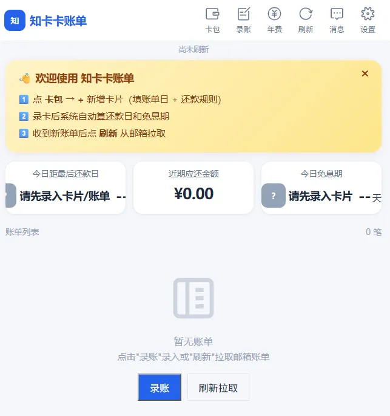

***


## 📖 初次使用指南

### 第一步：配置 QQ 邮箱

程序需要连接你的 QQ 邮箱来抓取信用卡账单邮件。

1. 点击首页右上角的 **「设置」** 按钮
2. 在「邮箱配置」区域填写：
   * **QQ 邮箱账号**：你的 QQ 邮箱地址（如 `yourname@qq.com`）
   * **邮箱授权码**：QQ 邮箱的授权码（**不是 QQ 密码！**）
3. 点击 **「测试连接」**，提示「邮箱连接成功」即可
4. 点击 **「保存」**

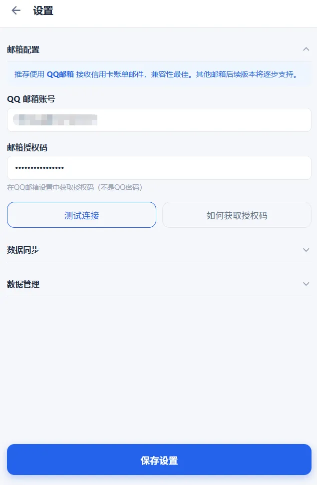

#### 如何获取 QQ 邮箱授权码？

1. 登录 QQ 邮箱网页版：[https://mail.qq.com](https://mail.qq.com)
2. 点击顶部「设置」→「账户」
3. 找到「POP3/IMAP/SMTP/Exchange/CardDAV/CalDAV服务」区域
4. 确保 **「IMAP/SMTP服务」** 已开启
5. 点击 **「生成授权码」**
6. 按提示用绑定手机发送短信验证
7. 复制生成的 **16 位授权码**，填入程序中

> ⚠️ 授权码只显示一次，请妥善保存。如果忘记了，重新生成一个即可，旧的会自动失效。


***

### 第二步：添加信用卡

在抓取账单之前，需要先把你的信用卡信息录入卡包，这样程序才能根据账单日和还款规则计算免息期和还款日。

1. 点击顶部导航栏的 **「卡包」**
2. 点击 **「+ 新增卡片」**

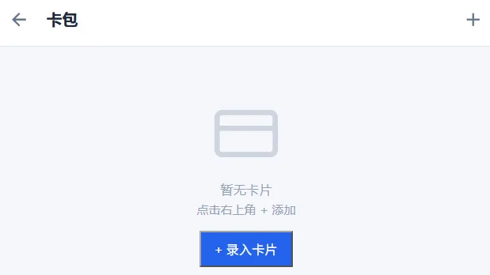

3. 填写卡片信息：
   * **发卡银行**：选择银行（如招商银行、广发银行等）
   * **卡号**：填写完整卡号（用于识别尾号，仅保存在本地）
   * **持卡人**：持卡人姓名
   * **账单日**：每月几号出账单（如 15 号）
   * **还款规则**：二选一
     * **固定日期**：每月固定某一天还款（如每月 8 号）
     * **固定天数**：账单日后 N 天还款（如账单日后 20 天）
   * **信用额度**：卡片总额度（如 50000）
   * **年费信息**：可选，记录年费规则（如每年刷 6 次免年费）

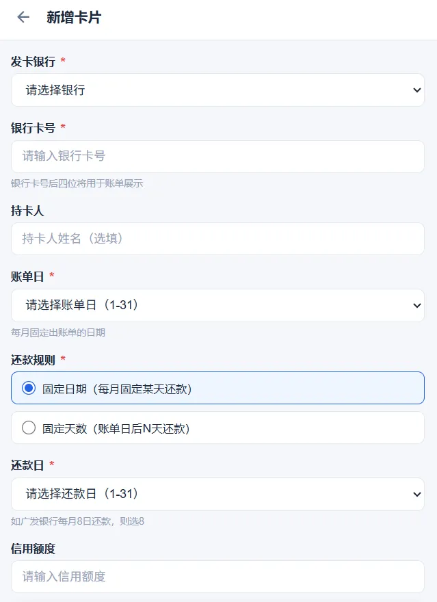

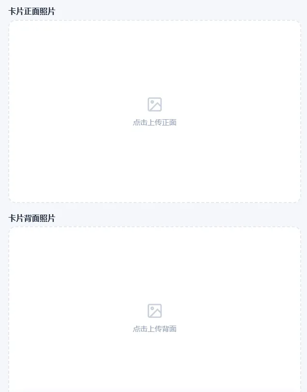

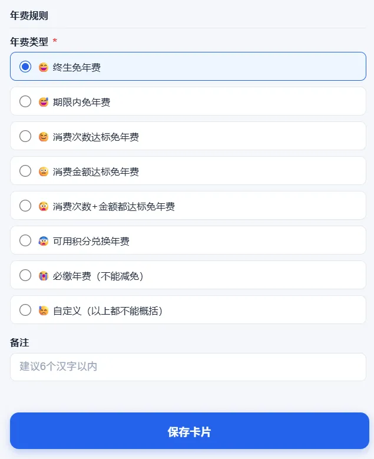

4. 点击 **「保存卡片」**

重复以上步骤，添加所有信用卡

> 💡 **小技巧**：添加完卡片后，卡包页面会显示所有卡片的列表，底部显示卡片总数和总信用额度。点击某张卡片可以查看详情、编辑或删除。

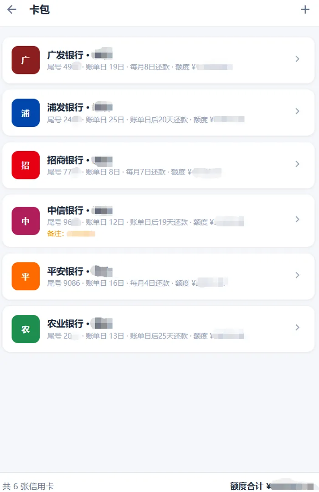

***

### 第三步：抓取账单

配置好邮箱和卡片后，就可以一键抓取账单了。

1. 回到 **「首页」**
2. 点击 **「刷新」** 按钮
3. 程序会自动：
   * 连接 QQ 邮箱
   * 搜索最近 60 天的邮件
   * 识别 11 家银行的账单邮件
   * 解析账单金额
   * 根据卡片的还款规则计算还款日
4. 抓取完成后，首页会显示识别到的账单列表

> ⏱️ 首次抓取可能需要 5-15 秒，取决于邮件数量。后续刷新会更快。

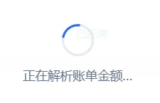


> 💡 **注意**：如果某张卡的账单邮件没有被识别到，请检查：
>
> * 该银行的账单邮件是否发到了这个 QQ 邮箱
> * 邮件是否在最近 60 天内
> * 可以手动录入该笔账单（点击「录账」按钮）

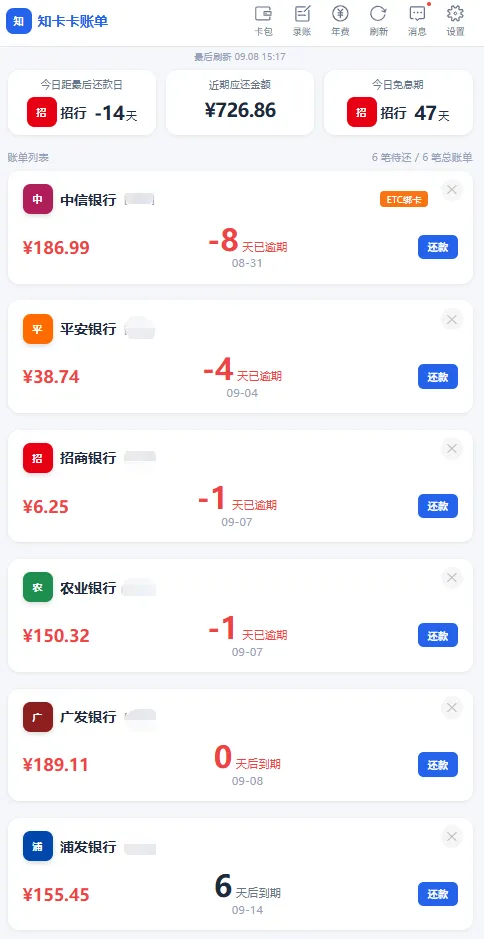


***

### 第四步：查看今日免息期榜单

免息期榜单是本工具的核心功能之一，帮助你决定**今天刷哪张卡能享受最长的免息期**。

1. 在首页可以看到 **「今日免息」** 统计卡片，显示今天免息期最长的卡和天数

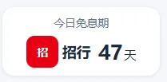

2. 点击该卡片可以查看完整的免息期榜单

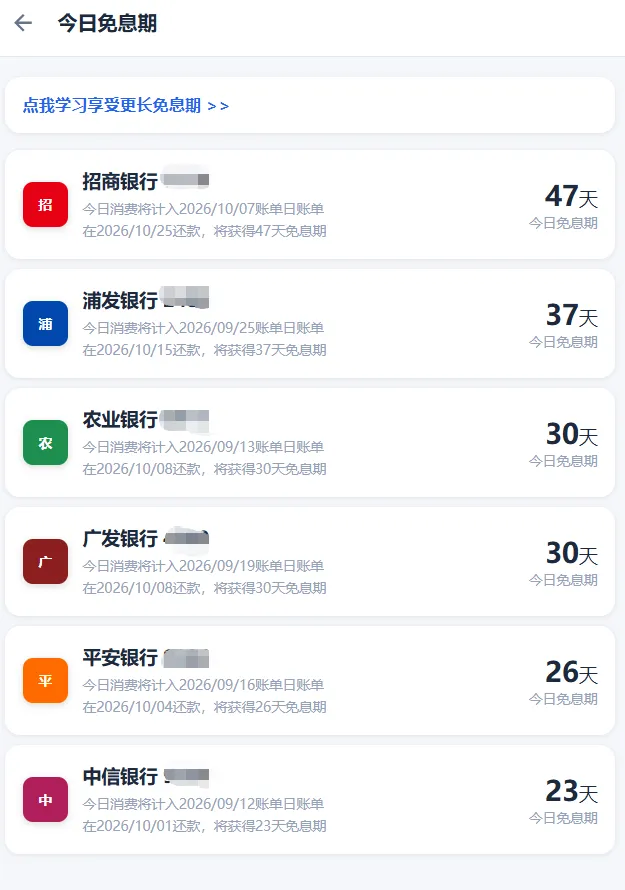

3. 榜单按免息天数从多到少排列，每张卡显示：
   * 银行名称和卡号尾号
   * 免息天数
   * 账单日
   * 还款规则
   * 对应的账单日和还款日

> 💡 **如何使用**：今天要刷卡消费时，优先刷榜单排名第一的卡，这样能享受最长的免息期，相当于免费借用银行的钱更久。


***

### 第五步：标记还款

账单出来后，到了还款日还完款，记得在程序里标记已还。

1. 在首页账单列表中找到对应的账单
2. 点击该账单进入详情
3. 点击 **「标记已还」** 按钮
4. 账单状态会从「待还」变为「已还」
5. 首页的「近期应还」统计会自动更新

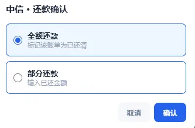

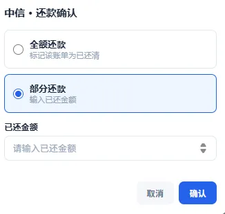

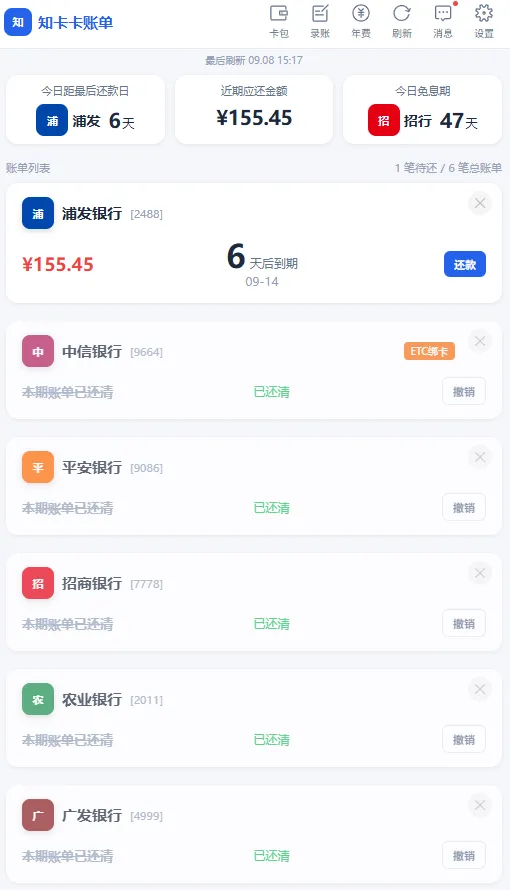

> 💡 也可以在首页账单列表中直接点击账单右侧的快捷操作按钮来标记已还。

***

### 第六步：添加自定义账单

除了信用卡账单，你还可以录入其他需要定期还款的账单，如保险、贷款、房租等。

1. 点击首页的 **「录账」** 按钮
2. 在弹出的表单中切换到 **「自定义账单」** 标签
3. 填写：
   * **账单名称**：如「平安保险」「房贷」「房租」
   * **每期金额**：还款金额
   * **还款日期**：本次还款的截止日期
   * **还款周期**：每月/每季度/每年/一次性（可选）
   * **备注**：可选
4. 点击 **「保存」**

自定义账单会和信用卡账单一起显示在首页账单列表中，到期前也会提醒。

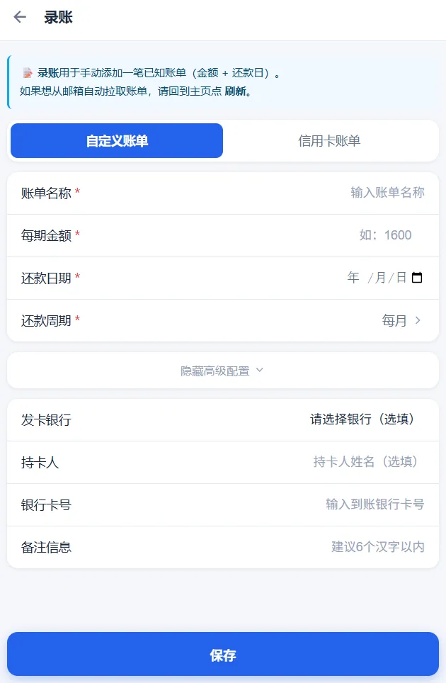

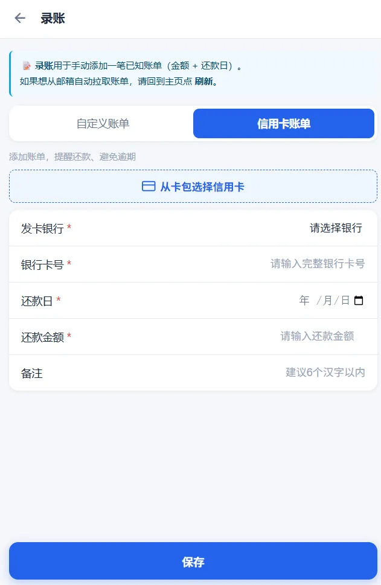

***

### 第七步：年费管理

很多信用卡有年费，但只要每年消费达到一定次数或金额就能免年费。程序帮你记录每张卡的年费规则和消费进度。

1. 点击顶部导航栏的 **「年费」**
2. 页面显示每张卡的年费达标情况
3. 点击某张卡可以查看详情和设置年费规则：
   * **年费类型**：终生免年费 / 期限内免年费 / 消费次数达标 / 消费金额达标 / 次数+金额都达标 / 积分兑换 / 必缴年费 / 自定义
   * **达标条件**：根据年费类型填写对应的次数或金额
   * **本年已消费**：程序会根据账单自动统计（也可手动更新）
4. 达标的卡片会显示绿色「已达标」，未达标的显示橙色「未达标」并提醒还差多少

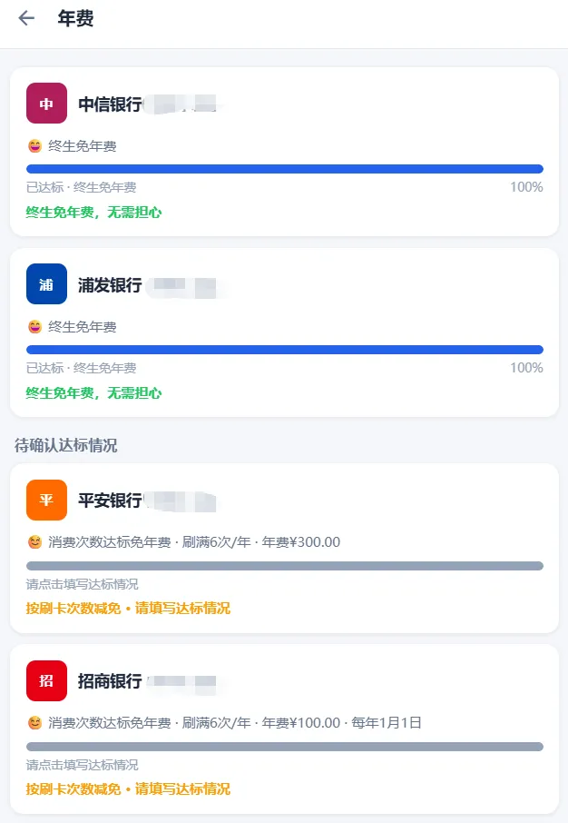


***

## 🗂️ 界面说明

| **页面** | **入口**       | **功能**                         |
| ------ | ------------ | ------------------------------ |
| 首页     | 顶部「首页」       | 统计概览、账单列表、还款提醒、今日免息期入口、刷新/录账按钮 |
| 卡包     | 顶部「卡包」       | 信用卡列表、新增/编辑/删除卡片、查看卡片详情        |
| 年费     | 顶部「年费」       | 年费规则管理、消费达标进度跟踪                |
| 消息     | 顶部「消息」（铃铛图标） | 新账单提醒、还款提醒等系统消息                |
| 设置     | 首页右上角「设置」    | 邮箱配置、数据管理（导出/导入/清空）、提醒设置       |


***

## 💾 数据备份与恢复

所有数据保存在程序目录下的 `data/zhikaka_data.json` 文件中，包含：

* 信用卡信息
* 账单记录
* 自定义账单
* 邮箱配置（含授权码）
* 消息记录

### 备份数据

直接复制 `data/zhikaka_data.json` 文件到安全位置即可。建议定期备份。

### 恢复数据

将备份的 `zhikaka_data.json` 文件复制回 `data/` 目录，覆盖现有文件，然后刷新浏览器即可。

### 导出/导入

在「设置」→「数据管理」中，可以：

* **导出数据**：下载当前所有数据的 JSON 文件
* **导入数据**：从之前导出的 JSON 文件恢复数据
* **清空数据**：删除所有数据（谨慎操作，建议先备份）

> ⚠️ `data/zhikaka_data.json` 包含你的邮箱授权码和信用卡信息，请不要分享给他人，也不要提交到 Git 仓库（.gitignore 已自动排除）。

***

## ❓ 常见问题

### Q: 为什么抓不到账单？

A: 请依次检查：

1. 邮箱账号和授权码是否正确（点「测试连接」验证）
2. 信用卡账单邮件是否发到了这个 QQ 邮箱（有些银行默认发到注册时的邮箱）
3. 邮件是否在最近 60 天内（超过 60 天的邮件不会搜索）
4. 银行是否在支持列表中（目前支持 11 家）
5. 可以在邮箱中搜索「账单」关键词，确认银行是否发了电子账单

### Q: 支持其他邮箱吗（如 163、Gmail、Outlook）？

A: 当前版本默认配置为 QQ 邮箱 IMAP。其他邮箱可以修改 `server.py` 中的 `DEFAULT_IMAP_SERVER` 和 `DEFAULT_IMAP_PORT` 来支持（需要对应邮箱开启 IMAP 服务并使用对应授权码）。后续版本会增加邮箱选择功能。

### Q: 数据会丢失吗？

A: 数据保存在 `data/zhikaka_data.json`，只要不删除这个文件就不会丢失。程序同时使用浏览器 localStorage 和服务器 JSON 文件双存储，互为备份。建议定期备份 `data/` 目录。

### Q: 可以多台电脑同步数据吗？

A: 本地版不支持云端自动同步。如果需要多设备使用，可以将 `data/zhikaka_data.json` 放到网盘同步目录（如百度网盘、OneDrive），在不同电脑上指向同一个文件。

### Q: 为什么有些账单解析不出金额？

A: 部分银行的账单邮件中金额是图片形式（如招商银行某些版本的邮件），无法通过文本解析识别。这种情况可以：

1. 点击「录账」手动录入账单金额
2. 在银行 App 中查看账单后手动更新

### Q: 程序需要一直开着吗？

A: 不需要。程序是手动刷新模式，只有你点击「刷新」时才会连接邮箱抓账单。平时可以关掉，需要时再打开。本地版不支持定时自动抓取（需要电脑一直开机，意义不大）。

### Q: 手机能用吗？

A: 程序运行在电脑上，手机和电脑在同一个 WiFi 网络下时，可以用手机浏览器访问 `http://电脑IP:5000` 来使用。但程序默认只监听 `127.0.0.1`（仅本机访问），如果需要手机访问，需要修改 `server.py` 最后一行的 `host="127.0.0.1"` 为 `host="0.0.0.0"`。

> ⚠️ 改为 `0.0.0.0` 后，同一局域网内的其他设备也能访问，请确保网络环境安全。

***

## 🔧 故障排查

### 启动报错：`ModuleNotFoundError: No module named 'flask'`

依赖未安装，运行 `pip install -r requirements.txt`。

### 启动报错：`Address already in use`

端口 5000 被占用。可以关闭占用端口的程序，或者修改 `server.py` 最后一行的 `port=5000` 为其他端口（如 5001），然后访问 `http://localhost:5001`。

### 测试邮箱连接失败：`AUTHENTICATIONFAILED`

* 授权码错误，请重新生成授权码
* QQ 邮箱的 IMAP/SMTP 服务未开启
* 账号填写错误（注意是完整的邮箱地址，不是 QQ 号）

### 刷新很慢或超时

* 邮件太多时首次抓取可能较慢，耐心等待
* 检查网络连接是否正常
* 可以减少 `server.py` 中的 `SEARCH_DAYS`（默认 60 天），改为 30 天加快速度

### 页面空白或加载不出来

* 确认程序已启动（命令行窗口显示「访问地址: http://localhost:5000」）
* 确认访问地址正确（http://localhost:5000，不是 https）
* 尝试刷新浏览器（Ctrl+F5 强制刷新）
* 查看命令行窗口是否有报错信息

### 中文显示乱码（Windows）

* 确保使用 `启动知卡卡.bat` 启动（已处理 Windows 编码兼容问题）
* 如果直接用 `python server.py` 启动且中文乱码，先运行 `chcp 65001` 再启动

***

## 📁 项目结构

```
ZhiKaKa-Bills/
├── server.py              # Flask 后端服务（API + 静态文件 + IMAP 抓账单）
├── bill_parser.py         # 信用卡账单邮件解析模块（11 家银行，三层容错）
├── web/
│   └── index.html         # 前端单页应用
├── data/                  # 数据目录（运行时生成 JSON，已被 .gitignore 排除）
│   └── .gitkeep
├── 启动知卡卡.bat          # Windows 一键启动脚本
├── start.sh               # macOS / Linux 启动脚本
├── requirements.txt       # Python 依赖（flask + flask-cors）
├── .gitignore             # Git 忽略规则（排除数据文件、日志、缓存等）
├── LICENSE                # MIT 许可证
└── README.md              # 项目说明文档（本文件）
```

***

## 🤝 贡献

欢迎提交 Issue 和 Pull Request！

* 发现 Bug 请提交 Issue，附上银行名称和邮件截图（注意脱敏）
* 想增加新银行支持，请提交 PR，并附上该银行的账单邮件样例
* 有功能建议也欢迎讨论

### 开发环境搭建

```bash
# 克隆仓库
git clone https://github.com/ai-yukin/ZhiKaKa-Bills.git
cd ZhiKaKa-Bills

# 创建虚拟环境（推荐）
python -m venv .venv
# Windows:
.venv\Scripts\activate
# macOS/Linux:
source .venv/bin/activate

# 安装依赖
pip install -r requirements.txt

# 启动开发服务器
python server.py
```

***

## 📄 License

MIT © 2026 ai-yukin

详见 [LICENSE](LICENSE) 文件。

***

> 💬 **使用中有任何问题，欢迎在 GitHub 提交 Issue，或查看上方的「常见问题」和「故障排查」。**
